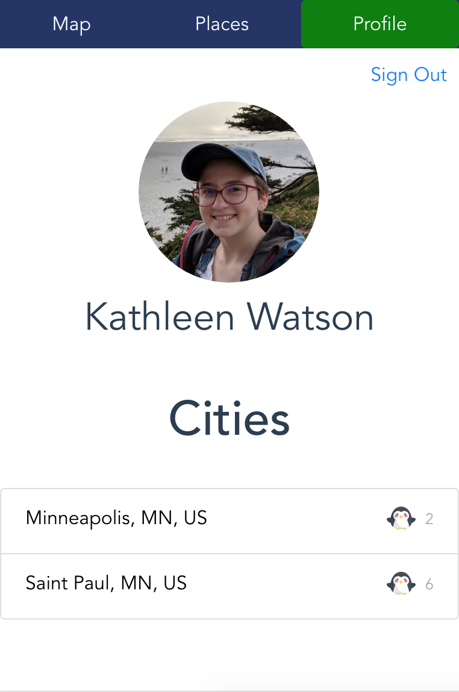
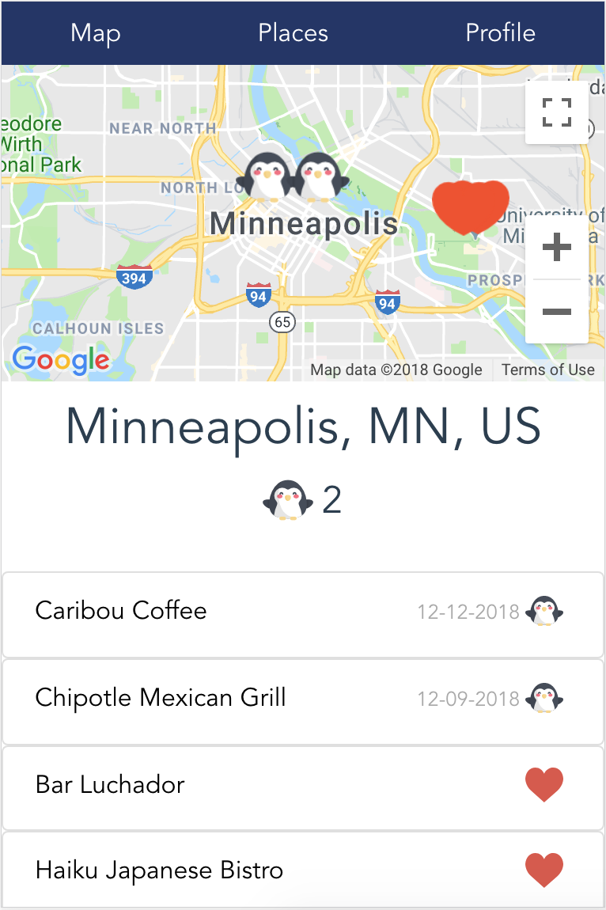
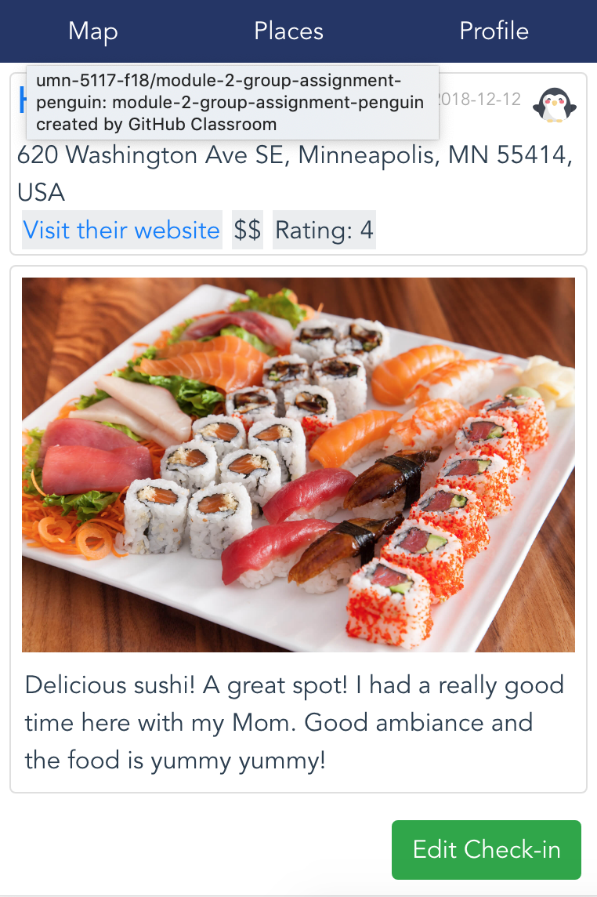
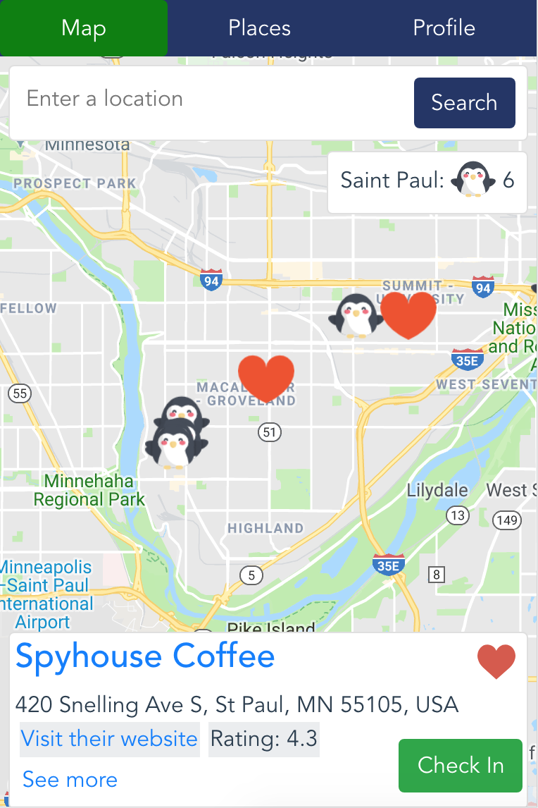

# Module 2 Group Assignment

CSCI 5117, Fall 2018, [assignment description](https://docs.google.com/document/d/1NN_rCSks6TT1TS7TaVXFsRIBCYeqs5MUa4ijEN-Vhoo/edit)

## App Info:

* Team Name: Penguin
* App Name: PenguinExplorer
* App Link: <https://module2penguin.firebaseapp.com>

### Students

* Adel Al-Dawood, aldaw004@umn.edu
* Kathleen Watson, watso559@umn.edu
* Tu Do, doxxx160@umn.edu
* Tian-Ruei Kuan, kuan0021@umn.edu

## Key Features

**Describe the most challenging features you implemented
(one sentence per bullet, maximum 4 bullets):**

* ...

Which device integration(s) does your app support?

* ...

Which progressive web app feature(s) does your app support?

* Add to home screen(only works for Android)

## Testing Notes

**Is there anything special we need to know in order to effectively test your app? (optional):**

* ...

## Screenshots of Site

On the profile page, a user can see all of their cities and their score in each city.  Clicking on a city will take you to the page for that city.

Here in the city page the user can see the map for a particular city and all their places in that city.  Click on a city to access the place page, which holds more info.

The place page is where the user can see info about a place.  If they have added a post about the place after checking in, it will appear on this page.  Otherwise, they will see photos pulled from google maps.  Here they can also toggle whether the place is on their wishlist (if they have not checked in)

On the map, users can search for places to add and either check-in at a place or add it to their wishlist.  Search result will pull up some info about the place.  You can also click on markers for your places to see their info or review your post for that place.  Click on the name of a place or "see more" to view the full place page.

## Paper Prototype

**[Add images/photos that show your paper prototype (maximum 4)](https://stackoverflow.com/questions/10189356/how-to-add-screenshot-to-readmes-in-github-repository) along with a very brief caption:**

*Explore the cities is an app to track places you have visited and compete with your friends on how well you know your city or other cities you visit*

## External Dependencies

**Document integrations with 3rd Party code or services here.
Please do not document required libraries (e.g., Vue, Vuefire, Firebase).**

* Library or service name: description of use
* Bootstrap
* Font Awesome: icons
* Flaticon: icons
* momentjs: date

**If there's anything else you would like to disclose about how your project
relied on external code, expertise, or anything else, please disclose that
here:**

...
